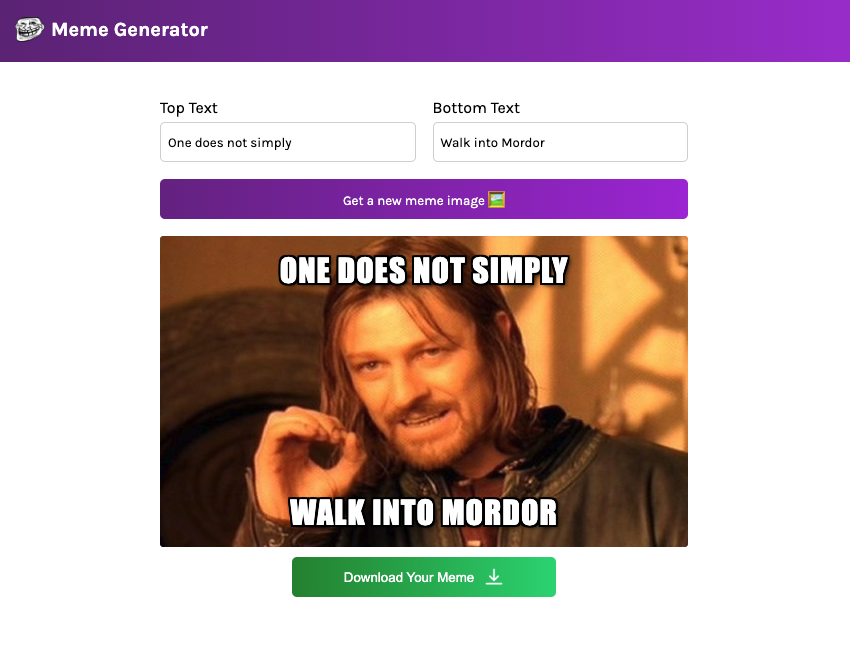

# Meme Generator 🎭

A simple **React-based meme generator** that fetches images from the [Imgflip API](https://api.imgflip.com) and allows users to add custom top and bottom text to create memes.

  

---

## 🚀 Live Demo
[View on Vercel](https://meme-generator-vert-seven.vercel.app/)  

---

## ✨ Features
- Fetches random meme images from the Imgflip API
- Allows user to add **top** and **bottom** text dynamically
- Clean, responsive UI with custom styling
- Real-time text updates on the meme

---

## 🛠️ Built With
- **React.js** (Vite)
- **JavaScript (ES6+)**
- **CSS3**
- **Imgflip API**

---

## 📦 Installation & Usage
```bash
# Clone the repository
git clone https://github.com/YOUR_USERNAME/meme-generator.git

# Navigate into the project folder
cd meme-generator

# Install dependencies
npm install

# Start the development server
npm run dev
```
